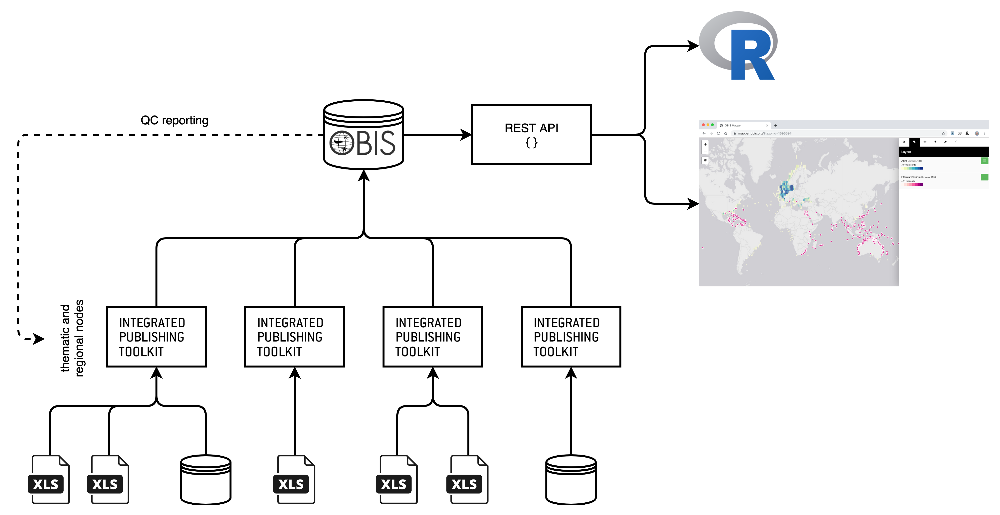
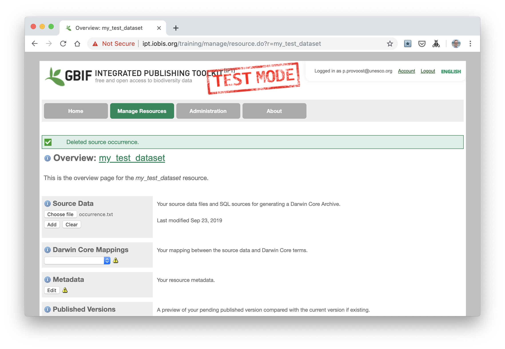
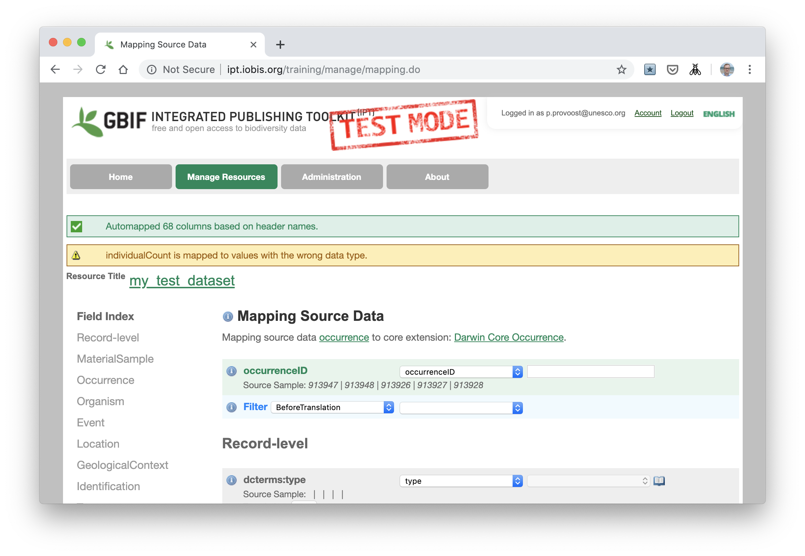
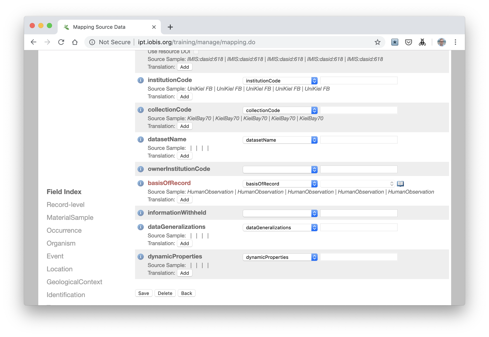
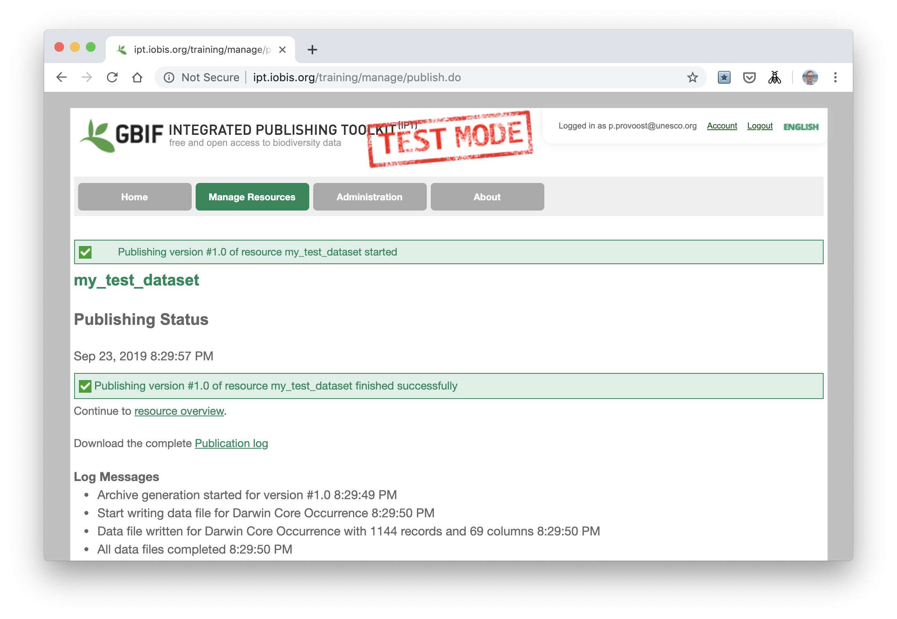
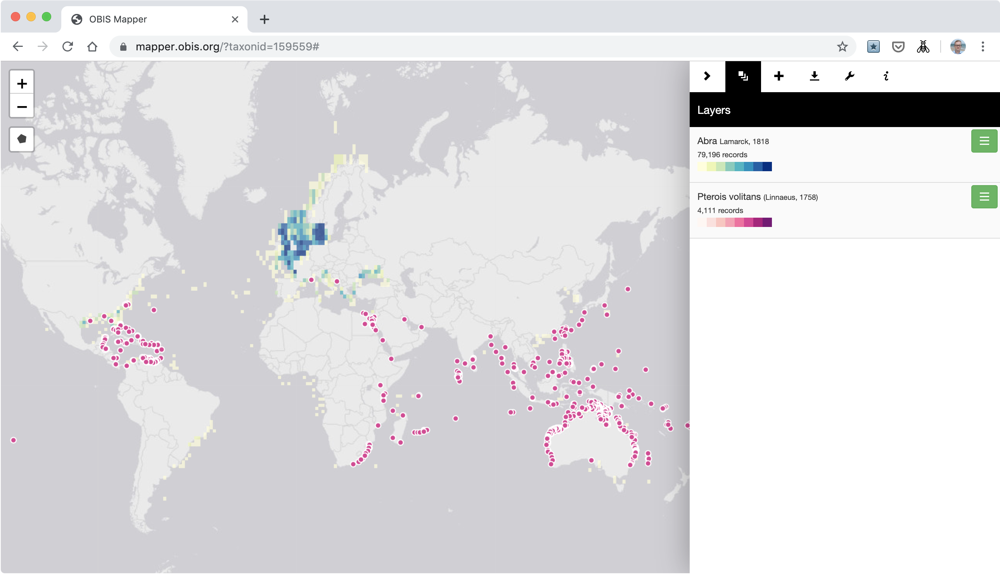
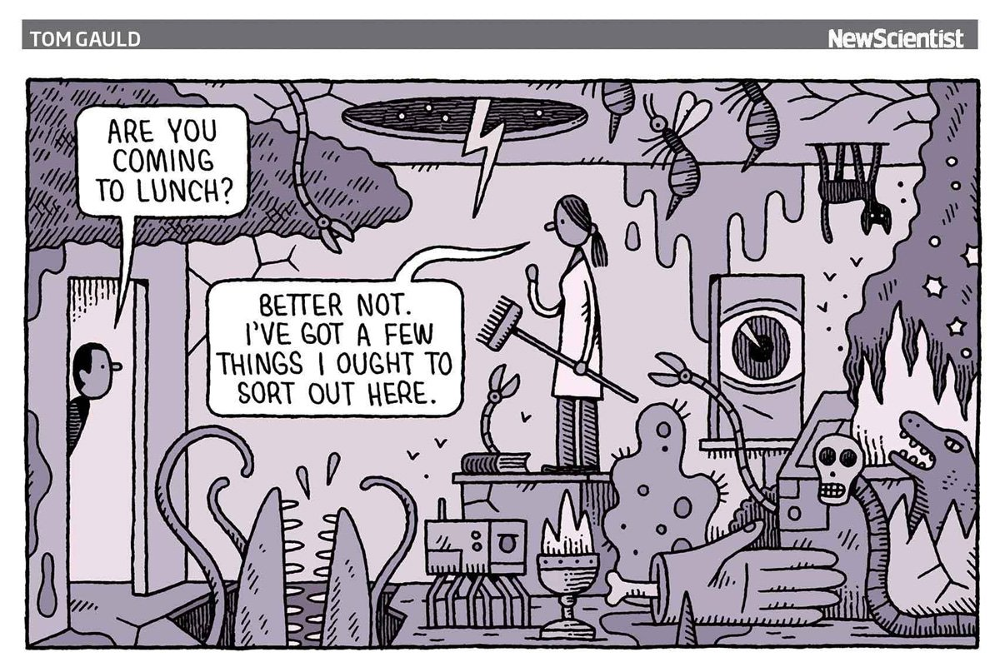
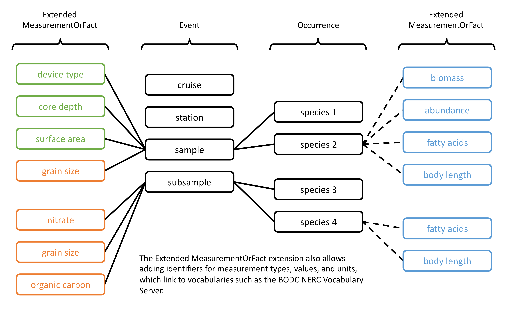

---
output:
  revealjs::revealjs_presentation:
    fig_width: 6
    fig_height: 4
    self_contained: false
    css:
    - css/style.css
    - css/highlight.css
    theme: simple
    highlight: tango
    transition: none
    background_transition: none
    slide_level: 1
    reveal_options:
      slideNumber: false
      center: true
      controls: false
editor_options: 
  chunk_output_type: console
---

# Introduction to OBIS { data-background="#f56c42" #titleslide }
### Data standards, publishing, and access

Jakarta, 27 September 2019

Pieter Provoost  
p.provoost@unesco.org

--- 

### Overview

- Data standards
  - Darwin Core
  - Darwin Core Archive
- OBIS data flow
- Data publishing
- Data access
- Quality control
- Rich datasets

--- 

# Data standards

---

The OBIS network uses the following standards to exchange data and metadata:

- Darwin Core (DwC)
- Ecological Metadata Language (EML)
- Darwin Core Archive (DwC-A)

--- 

## Darwin Core (DwC)

> Darwin Core is a standard maintained by the Darwin Core maintenance group. It includes a glossary of terms (in other contexts these might be called properties, elements, fields, columns, attributes, or concepts) intended to facilitate the sharing of information about biological diversity by providing identifiers, labels, and definitions.

website: https://dwc.tdwg.org/  
quick reference guide: https://dwc.tdwg.org/terms/

---

### DwC terms: location

<small>

| term | definition | type | examples |
| ---- | ---- | ---- | ---- |
| decimalLongitude | longitude in decimal degrees | numeric | 128.3 |
| decimalLatitude | latitude in decimal degrees | numeric | 51.682 |
| coordinateUncertaintyInMeters | coordinate uncertainty in meters | numeric | 18 |
| minimumDepthInMeters | minimum depth in meters | numeric | 0 |
| maximumDepthInMeters | maximum depth in meters | numeric | 10 |
| locality | the most specific description of the location (may be modified) | text | Pulau Sagara, Sulawesi, Indonesia |
| verbatimLocality | the most specific description of the location (original) | text | Pulau Sagara |
| footprintWKT | locality in WKT format | WKT | POLYGON ((119.45 -4.67, 119.42 -4.71, 119.45 -4.73, 119.48 -4.71, 119.45 -4.67)) |
| geodeticDatum | ellipsoid, geodetic datum, or spatial reference system | text | EPSG:4326 |

</small>

---

### DwC terms: location
#### footprintWKT

> Well-known text (WKT) is a text markup language for representing vector geometry objects on a map.

examples: https://en.wikipedia.org/wiki/Well-known_text_representation_of_geometry  
map tool: https://obis.org/maptool

---

### DwC terms: time

  
<small>https://xkcd.com/1179/</small>

---

### DwC terms: time

<small>

| term | definition | type | examples |
| ---- | ---- | ---- | ---- |
| eventDate | the date-time or interval during which an event occurred | ISO 8601 | 2018 <br/> 2018-01 <br/> 2018-01-02 <br/> 2018-01-02T12:34:56 <br/> 2018-01-02/2018-02-03 <br/> 2018-01/2018-02 |

</small>

---

### DwC terms: taxonomy

<small>

| term | definition | type | examples |
| ---- | ---- | ---- | ---- |
| scientificName | | text | Abra alba |
| scientificNameID | identifier for the scientific name, should be a WoRMS LSID | LSID | urn:lsid:marinespecies.org:taxname:129697 |
| identificationQualifier | phrase ("cf.", "aff.") to express the determiner's doubts about the identification | text | cf. balteata |
| identifiedBy | list of people or groups who identified the subject | text | Theodore Pappenfuss \| Robert Macey |
| identificationRemarks || text | distinguished from Metopa pusilla based on the uni-articulate palp |

</small>

---

### DwC terms: identifiers

<small>

| term | definition | type | examples |
| ---- | ---- | ---- | ---- |
| institutionID | identifier for the institution having custody of the object or information | URI | http://biocol.org/urn:lsid:biocol.org:col:34777 | 
| institutionCode | name in use by the institution having custody of the object or information | text | VLIZ | 
| collectionID | identifier for the collection or dataset from which the record was derived | URI | | 
| collectionCode | name identifying the collection or dataset from which the record was derived | text | | 
| occurrenceID | globally unique identifier for the occurrence | URI | urn:catalog:UWBM:Bird:89776 | 
| catalogNumber | identifier for the record within the dataset or collection | text ||
| fieldNumber | identifier given to the event in the field | text | | 

</small>

---

### DwC terms: OBIS required terms

- occurrenceID
- eventDate
- decimalLongitude
- decimalLatitude
- scientificName
- scientificNameID
- occurrenceStatus
- basisOfRecord

--- 

## Darwin Core Archive (DwC-A)

> Darwin Core Archive (DwC-A) is a biodiversity informatics data standard that makes use of the Darwin Core terms to produce a single, self contained dataset for sharing species-level (taxonomic), species-occurrence data, and sampling-event data.

--- 

  
<small>https://github.com/gbif/ipt/wiki/DwCAHowToGuide</small>

--- 

### Darwin Core Archive (DwC-A): meta.xml

`meta.xml` is the archive descriptor

```xml
<archive xmlns="http://rs.tdwg.org/dwc/text/" metadata="eml.xml">
  <core encoding="UTF-8" fieldsTerminatedBy="\t" linesTerminatedBy="\n"
    fieldsEnclosedBy="" ignoreHeaderLines="1"
    rowType="http://rs.tdwg.org/dwc/terms/Occurrence">
    <files>
      <location>occurrence.txt</location>
    </files>
    <id index="0" />
    <field index="6" term="http://rs.tdwg.org/dwc/terms/institutionCode"/>
    <field index="7" term="http://rs.tdwg.org/dwc/terms/collectionCode"/>
    <field index="9" term="http://rs.tdwg.org/dwc/terms/basisOfRecord"/>
    <field index="12" term="http://rs.tdwg.org/dwc/terms/occurrenceID"/>
    <field index="13" term="http://rs.tdwg.org/dwc/terms/catalogNumber"/>
    <field index="15" term="http://rs.tdwg.org/dwc/terms/recordNumber"/>
    <field index="20" term="http://rs.tdwg.org/dwc/terms/occurrenceStatus"/>
    <field index="28" term="http://rs.tdwg.org/dwc/terms/eventDate"/>
    <field index="57" term="http://rs.tdwg.org/dwc/terms/scientificNameID"/>
    <field index="58" term="http://rs.tdwg.org/dwc/terms/scientificName"/>
  </core>
  <extension encoding="UTF-8" fieldsTerminatedBy="\t" linesTerminatedBy="\n"
    fieldsEnclosedBy="" ignoreHeaderLines="1"
    rowType="http://rs.iobis.org/obis/terms/ExtendedMeasurementOrFact">
    <files>
      <location>extendedmeasurementorfact.txt</location>
    </files>
    <coreid index="0" />
    <field index="1" term="http://rs.tdwg.org/dwc/terms/measurementID"/>
    <field index="2" term="http://rs.tdwg.org/dwc/terms/occurrenceID"/>
    <field index="3" term="http://rs.tdwg.org/dwc/terms/measurementType"/>
    <field index="4" term="http://rs.iobis.org/obis/terms/measurementTypeID"/>
    <field index="5" term="http://rs.tdwg.org/dwc/terms/measurementValue"/>
    <field index="6" term="http://rs.iobis.org/obis/terms/measurementValueID"/>
    <field index="7" term="http://rs.tdwg.org/dwc/terms/measurementAccuracy"/>
    <field index="8" term="http://rs.tdwg.org/dwc/terms/measurementUnit"/>
    <field index="9" term="http://rs.iobis.org/obis/terms/measurementUnitID"/>
    <field index="10" term="http://rs.tdwg.org/dwc/terms/measurementDeterminedDate"/>
    <field index="11" term="http://rs.tdwg.org/dwc/terms/measurementDeterminedBy"/>
    <field index="12" term="http://rs.tdwg.org/dwc/terms/measurementMethod"/>
    <field index="13" term="http://rs.tdwg.org/dwc/terms/measurementRemarks"/>
  </extension>
</archive>
```

--- 

### Darwin Core Archive (DwC-A): eml.xml

`eml.xml` contains the dataset metadata in EML

```xml
<?xml version="1.0" encoding="UTF-8"?>
<eml:eml xmlns:eml="eml://ecoinformatics.org/eml-2.1.1" xmlns:dc="http://purl.org/dc/terms/" xmlns:xsi="http://www.w3.org/2001/XMLSchema-instance" xsi:schemaLocation="eml://ecoinformatics.org/eml-2.1.1 http://rs.gbif.org/schema/eml-gbif-profile/1.1/eml.xsd" packageId="ef5c63cc-ed75-47b2-a6fd-60969f4fad07/v1.1" system="http://gbif.org" scope="system" xml:lang="eng">
  <dataset>
    <alternateIdentifier>http://ipt.vliz.be/eurobis/resource?r=kielbay70</alternateIdentifier>
    <title xml:lang="eng">70 samples data of Kiel Bay</title>
    <creator>
      <organizationName>Christian-Albrechts-University Kiel; Leibniz Institute of Marine Sciences Marine Ecology Division (CAU)</organizationName>
    </creator>
    <creator>
      <individualName>
        <givenName>Heye</givenName>
        <surName>Rumohr</surName>
      </individualName>
      <organizationName>Christian-Albrechts-University Kiel; Leibniz Institute of Marine Sciences Marine Ecology Division (CAU)</organizationName>
      <electronicMailAddress>hrumohr@geomar.de</electronicMailAddress>
    </creator>
    <metadataProvider>
      <individualName>
        <surName>EurOBIS Data Management Team</surName>
      </individualName>
      <organizationName>Flanders Marine Institute (VLIZ)</organizationName>
      <address>
        <country>BE</country>
      </address>
      <electronicMailAddress>info@eurobis.org</electronicMailAddress>
      <onlineUrl>http://www.eurobis.org</onlineUrl>
    </metadataProvider>
    <pubDate>2019-09-19</pubDate>
    <language>eng</language>
    <abstract>
      <para>The ICES/HELCOM Intercalibration Exercise provided a series of replicate samples from one single station in Kiel Bay from May 1995</para>
    </abstract>
    <keywordSet>
      <keyword>Benthic fauna</keyword>
      <keyword>Benthos</keyword>
      <keyword>Biogeography</keyword>
      <keyword>Macrobenthos</keyword>
      <keywordThesaurus>ASFA</keywordThesaurus>
    </keywordSet>
    <intellectualRights>
      <para>
        This work is licensed under a
        <ulink url="http://creativecommons.org/licenses/by/4.0/legalcode">
          <citetitle>Creative Commons Attribution (CC-BY) 4.0 License</citetitle>
        </ulink>
        .
      </para>
    </intellectualRights>
    <contact>
      <individualName>
        <givenName>Dirk</givenName>
        <surName>Fleischer</surName>
      </individualName>
      <organizationName>Christian-Albrechts-University Kiel; Leibniz Institute of Marine Sciences Marine Ecology Division (CAU)</organizationName>
      <electronicMailAddress>dfleischer@kms.uni-kiel.de</electronicMailAddress>
    </contact>
    <contact>
      <individualName>
        <givenName>Heye</givenName>
        <surName>Rumohr</surName>
      </individualName>
      <organizationName>Christian-Albrechts-University Kiel; Leibniz Institute of Marine Sciences Marine Ecology Division (CAU)</organizationName>
      <electronicMailAddress>hrumohr@geomar.de</electronicMailAddress>
    </contact>
  </dataset>
</eml:eml>
```

--- 

### Darwin Core Archive (DwC-A): core tables

http://rs.gbif.org/core

--- 

### Darwin Core Archive (DwC-A): extension tables

http://rs.gbif.org/extension

--- 

# Data publishing



--- 

## Data publishing: IPT

> The Integrated Publishing Toolkit, or IPT, is open-source software developed by the GBIF Secretariat which enables the publishing of content in databases, Microsoft Excel spreadsheets, or text files using the open Darwin Core and Ecological Metadata Language standards.

manual: https://github.com/gbif/ipt/wiki/IPT2ManualNotes.wiki  
training instance: http://ipt.iobis.org/training/

--- 

### Step 1: create dataset


--- 

### Step 2: upload data files



--- 

### Step 2: upload data files


--- 

### Step 2: upload data files


--- 

### Step 2: upload data files


--- 

### Step 3: map to Darwin Core


--- 

### Step 3: map to Darwin Core



--- 

### Step 3: map to Darwin Core



--- 

### Step 3: map to Darwin Core


--- 

### Step 4: enter metadata


--- 

### Step 4: enter metadata


--- 

### Step 5: publish


--- 

### Step 5: publish



---

# Data access

---

## Data access: mapper



https://mapper.obis.org

---

## Data access: API

https://api.obis.org

---

## Data access: R package

https://github.com/iobis/robis

--- 

```{r, message = FALSE, warning = FALSE, cache = TRUE}
library(robis)

occ <- occurrence(areaid = 115) # fetch occurrences
str(occ) # display structure
```

--- 

```{r, message = FALSE, warning = FALSE, cache = TRUE}
library(dplyr)

stations <- occ %>%
  group_by(decimalLongitude, decimalLatitude) %>%
  summarize(records = n())

head(stations) # inspect first rows
```

--- 

```{r map_indonesia, echo = TRUE, eval = FALSE}
library(ggplot2)
library(rnaturalearth)
library(sf)

world <- ne_countries(country = "indonesia", scale = "large", returnclass = "sf")

ggplot() +
  geom_sf(data = world, fill = "#000000", color = "#000000") +
  geom_point(
    data = stations %>% arrange(records),
    aes(x = decimalLongitude, y = decimalLatitude, color = records), size = 0.8) +
  scale_color_viridis_c(trans = "log10", option = "plasma") +
  coord_sf() +
  ggtitle("OBIS occurrence records in Indonesia")
```

---

```{r map_indonesia, echo = FALSE, eval = TRUE, cache = TRUE, fig.width = 10}
```

---

```{r bars_indonesia, eval = FALSE, echo = TRUE}
library(RColorBrewer)

animalia <- occ %>% filter(kingdom == "Animalia" & !is.na(phylum) & !is.na(date_year))
colors <- colorRampPalette(brewer.pal(11, "RdBu"))(length(unique(animalia$phylum)))

ggplot(animalia) +
  geom_histogram(aes(x = date_year, fill = phylum), binwidth = 2) + 
  scale_fill_manual(values = colors)
```

--- 

```{r bars_indonesia, echo = FALSE, eval = TRUE, cache = TRUE, fig.width = 10, fig.height = 6}
```

--- 

```{r leaflet_invasives, eval = FALSE, echo = TRUE, cache = TRUE}
library(leaflet)
library(robis)

# fetch invasives occurrences
invasives <- occurrence(
  scientificname = c("Acanthaster planci", "Pterois volitans"),
  areaid = 115
)

# interactive map
leaflet(invasives) %>%
  addProviderTiles("Esri.WorldGrayCanvas") %>%
  addCircleMarkers(
    ~decimalLongitude, ~decimalLatitude, weight = 1, opacity = 1, fillOpacity = 0.3, stroke = FALSE,
    color = ~ifelse(scientificName == "Acanthaster planci", "#a2cf4a", "#cf4a9e"),
    radius = ~ifelse(!is.na(date_year) & date_year > 2000, 10, 3)
  )
```

---

```{r leaflet_invasives, echo = FALSE, eval = TRUE, cache = TRUE, message = FALSE, warning = FALSE}
```

--- 

```{r ebsa, eval = FALSE, echo = TRUE}
library(dggridR)

ebsa <- occurrence(areaid = "10126,10259")

dggs <- dgconstruct(projection = "ISEA", topology = "HEXAGON", res = 8)
ebsa$cell <- dgGEO_to_SEQNUM(dggs, ebsa$decimalLongitude, ebsa$decimalLatitude)$seqnum
stats <- ebsa %>%
  group_by(cell) %>%
  summarize(sp = length(unique(speciesid)))
grid <- dgcellstogrid(dggs, unique(ebsa$cell))
grid <- merge(grid, stats, by.x = "cell", by.y = "cell")

ggplot() + 
  geom_polygon(data = grid, aes(x = long, y = lat, group = group, fill = sp)) +
  geom_sf(data = world, fill = "#000000", color = "#000000") +
  scale_fill_viridis_c(trans = "log10", option = "plasma") +
  coord_sf() +
  ggtitle("Java-Sumatran Upwelling and Sulu-Sulawesi Marine Ecoregion diversity")
```

--- 

```{r ebsa, echo = FALSE, eval = TRUE, cache = TRUE, message = FALSE, warning = FALSE, fig.width = 10}
```

--- 

Tracking dataset?

--- 

# Quality control

---



---

## Quality control tools

OBIS performs a range of quality checks during data ingestion, but we also provide tools for data providers and OBIS nodes to check their data before submitting to OBIS. This includes web services and the [obistools](https://github.com/iobis/obistools) R package.

The following slides use a modified version of the [Fauna Bentonica](https://obis.org/dataset/e09d9c14-b5e0-4f92-83ef-9062d94b91ea) dataset.

---

```{r}
fauna <- read.csv("data/occurrence_edited.txt", sep = "\t")
str(fauna)
```

--- 

### Coordinates check

```{r, cache = TRUE}
plot_map(fauna, zoom = TRUE)
```

---

### Coordinates check

```{r, cache = TRUE}
onland <- check_onland(fauna, report = TRUE)
head(onland)
```

---

### Coordinates check

```{r, cache = TRUE}
onland <- check_onland(fauna)
plot_map(fauna, zoom = TRUE) +
  geom_point(data = onland, aes(decimalLongitude, decimalLatitude), color = "green")
```

---

### Date format check

```{r, cache = TRUE}
datecheck <- check_eventdate(fauna)
head(datecheck)
```

--- 

### Depth check

```{r depthcheck, cache = TRUE, message = FALSE, warning = FALSE, echo = TRUE, eval = FALSE}
xy <- lookup_xy(fauna, shoredistance = TRUE, grids = TRUE)
fauna <- cbind(fauna, xy)

ggplot(fauna) +
  geom_point(aes(bathymetry, minimumDepthInMeters)) +
  geom_abline() +
  geom_abline(linetype = "dashed", intercept = -50) +
  geom_abline(linetype = "dashed", intercept = 50) +
  geom_point(data = fauna %>% filter(abs(bathymetry - minimumDepthInMeters) > 50), aes(bathymetry, minimumDepthInMeters), color = "red")
```

---

### Depth check

```{r depthcheck, cache = TRUE, message = FALSE, warning = FALSE, echo = FALSE, eval = TRUE}
```

--- 

### Taxon matching

```{r, cache = TRUE, warning = FALSE, message = FALSE}
library(obistools) # devtools::install_github("iobis/obistools")

worms <- match_taxa(fauna$scientificName, ask = FALSE)
head(worms)
```

--- 

# Rich datasets

--- 


--- 




